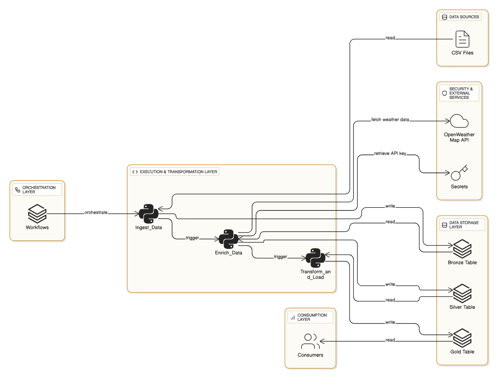
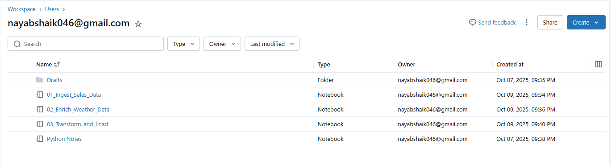
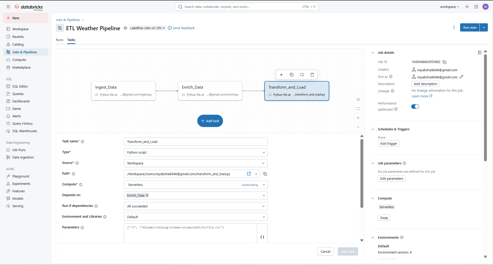
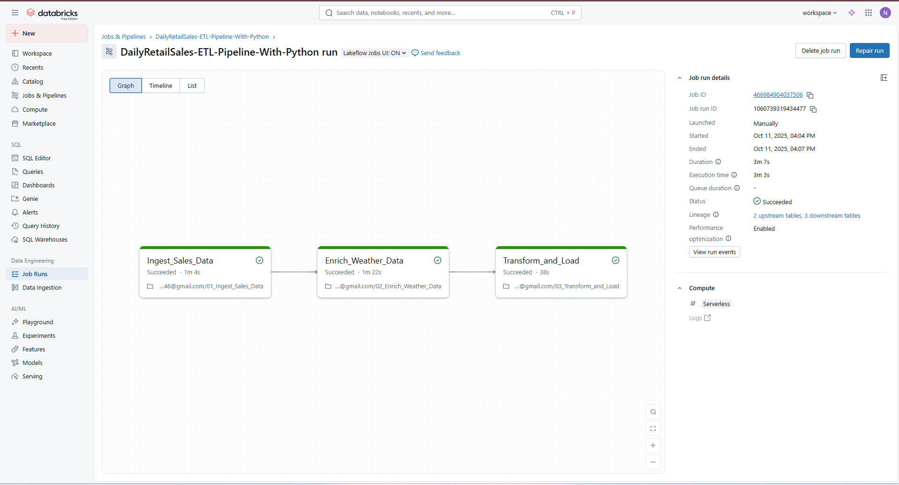

# Databricks ETL Pipeline: Weather Data Enrichment

**Author:** Nayab Rasool Shaik 

**Last Updated:** October 11, 2025

---

## 1. Project Overview

This project implements an end-to-end ETL (Extract, Transform, Load) pipeline built on the Databricks Lakehouse Platform. The primary goal is to ingest raw source data, enrich it with real-time weather information from the [OpenWeatherMap API](https://openweathermap.org/api), and load it into a series of structured Delta tables suitable for business intelligence and data analysis.

The pipeline follows the Medallion Architecture (Bronze, Silver, Gold layers) to ensure data quality, traceability, and modularity. Orchestration is handled using Databricks Jobs to create a robust, visual, and dependent workflow.



---

## 2. Pipeline Architecture

The pipeline is designed as a multi-task Databricks Job, where each task is a separate Python script responsible for a specific stage of the ETL process. Data is passed between tasks by writing and reading from Delta tables.

### Job Workflow:

- Task 1: Ingest_Data → Task 2: Enrich_Data → Task 3: Transform_and_Load

### Data Flow (Medallion Architecture):

- **Bronze Layer:** Raw, unaltered data ingested from the source.
- **Silver Layer:** Cleaned, validated, and enriched data. In this pipeline, the weather information is added at this stage.
- **Gold Layer:** Aggregated, business-level tables ready for analytics and reporting.

---

## 3. Project Structure

```
/
├── 1_ingest.py           # Script to ingest raw data into the Bronze table  
├── 2_enrich.py           # Script to enrich data with weather info (Bronze → Silver)  
├── 3_transform_load.py   # Script for final transformations and loading (Silver → Gold)  
└── README.md             # This documentation file  
```


> **Note:** The `main.py` script used for initial development has been replaced by the Databricks Job orchestrator and is no longer needed for the production pipeline.

---

## 4. Prerequisites

Before you begin, ensure you have the following:

- **A Databricks Workspace:** Access to a Databricks workspace on any cloud provider.
- **Databricks CLI:** The Databricks CLI installed and configured on your local machine.
- **OpenWeatherMap API Key:** A valid API key from [OpenWeatherMap](https://openweathermap.org/api).
- **Cluster Permissions:** Permissions to create or manage a cluster and install libraries.

---

## 5. Setup and Configuration Guide

Follow these steps to set up the pipeline in your environment.

### Step 1: Clone the Repository



Clone this project's code to your local machine and upload the Python scripts (`1_ingest.py`, `2_enrich.py`, `3_transform_load.py`) to a directory in your Databricks Workspace (e.g., under `/Workspace/Users/your-email/`).

---

### Step 2: Configure Databricks Secrets

To securely store your API key, you must create a Databricks secret. Run these commands in your local terminal (not a notebook).

**Create a Secret Scope:**  
(This scope name must match the one used in `2_enrich.py`)

```
databricks secrets create-scope --scope "nayabrasool786"
```

**Add Your API Key to the Scope:**  
(This key name must also match the one used in the script)
```
databricks secrets put --scope "nayabrasool786" --key "openweathermap-api-key"
```


This will open a text editor. Paste your API key, save, and close the editor. Your key is now securely stored.

---

### Step 3: Install Dependent Libraries on Your Cluster


The `2_enrich.py` script requires the `requests` library to call the API.

1. Navigate to **Compute** in your Databricks workspace and select the cluster you intend to use for the job.
2. Click the **Libraries** tab.
3. Click **Install New**.
4. Select **PyPI** as the source and enter `requests` in the Package field.
5. Click **Install**.


---

## 6. How to Run the Pipeline
\


This pipeline is designed to be run as a multi-task Databricks Job.

1. Navigate to **Workflows** from the left-hand menu and click the **Jobs** tab.
2. Click the blue **Create Job** button.
3. Give the job a descriptive name (e.g., "Hourly Weather ETL Pipeline").

---

### Task 1: Ingest_Data

- **Task name:** Ingest_Data
- **Type:** Python script
- **Path:** Browse to and select your `1_ingest.py` script in the workspace.
- **Cluster:** Select your configured cluster.
- Click **Create**.

---

### Task 2: Enrich_Data

- Click the **+** icon below the Ingest_Data task.
- **Task name:** Enrich_Data
- **Type:** Python script
- **Path:** Browse to and select your `2_enrich.py` script.
- **Depends on:** Select *Ingest_Data* from the dropdown. This ensures this task only runs after the first one succeeds.
- **Cluster:** Select the same cluster.
- Click **Create**.

---

### Task 3: Transform_and_Load

- Click the **+** icon below the Enrich_Data task.
- **Task name:** Transform_and_Load
- **Type:** Python script
- **Path:** Browse to and select your `3_transform_load.py` script.
- **Depends on:** Select *Enrich_Data*.
- **Cluster:** Select the same cluster.
- Click **Create**.


---

Your job is now fully configured! You can run it manually by clicking **Run now** or set a schedule (e.g., hourly) for automated execution.



---

## 7. Future Improvements

- **Parameterization:** Convert hardcoded table names and paths into job parameters for greater flexibility.
- **Error Handling & Notifications:** Implement try/except blocks and configure job notifications for failures (e.g., via email or Slack).
- **Data Quality Checks:** Integrate a data quality tool like Great Expectations to run checks after each stage.
- **CI/CD:** Set up a CI/CD pipeline using GitHub Actions or Azure DevOps to automate the deployment of code changes to the Databricks workspace.

---

## 🔗 Connect with Me
👋 Hi, I'm **NAYAB RASOOL SHAIK**

[](https://www.linkedin.com/in/nayabrasool-shaik)  
[](mailto:nayabshaik046@example.com)  
[](http://nayabrasool.my.canva.site/)

> _“Learn deeply, build practically, explain simply, and share widely.” – Shaik Nayab Rasool_
